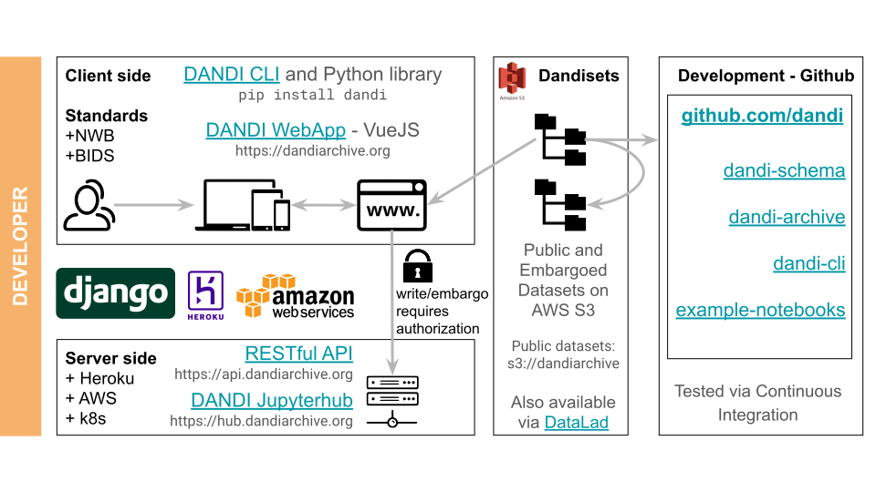

# {{ instance.name }} Ecosystem

The {{ instance.name }} project can be represented schematically:

The **Client side** contains the {{ instance.name }} Python CLI and {{ instance.name }} Web application.

The **Server side** contains a RESTful API and {{ instance.name }} JupyterHub.

The **Dandiset** is a file organization to store data together with metadata.

The {{ instance.name }} project is organized around several **GitHub** repositories:

| Repository | Description |
|----------|----------|
| [DANDI Archive](https://github.com/dandi/dandi-archive) | Contains the code for deploying the client-side Web application frontend based on the [Vue.js](https://vuejs.org/) framework as well as a Django-based backend to run the {{ instance.name }} REST API. 
| [DANDI JupyterHub](https://github.com/dandi/dandi-hub) | Contains the code for deploying a JupyterHub instance to support interaction with the {{ instance.name }} archive.
| [DANDI Python client](https://github.com/dandi/dandi-cli) | Contains the code for the command line tool used to interact with the archive. It allows you to download data from the archive. It also allows you to locally organize and validate your data before uploading to the archive. 
| [DANDI Docs](https://github.com/dandi/dandi-docs) | Provides the contents of this website.
| [helpdesk](https://github.com/dandi/helpdesk) | Contains our community help platform where you can submit [issues](https://github.com/dandi/helpdesk/issues/new/choose).
| [schema](https://github.com/dandi/schema) | Provides the details and some supporting code for the {{ instance.name }} metadata schema. 
| [schema Python library](https://github.com/dandi/dandi-schema) | Provides a Python library for updating the schema and for creating and validating {{ instance.name }} objects.
| [DANDI About website](https://github.com/dandi/dandi-about) | Provides an overview of the {{ instance.name }} project and the team members and collaborators. |
